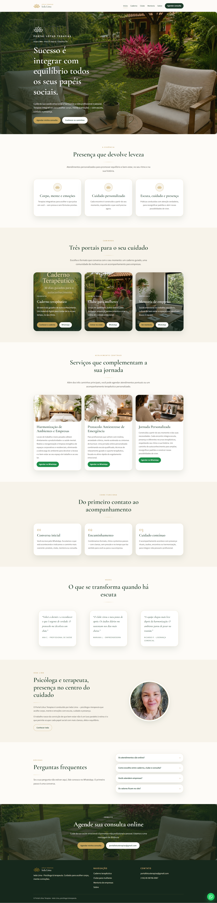

# Portal Lótus Terapias

Site da psicóloga **Ieda Lima**: caderno terapêutico, clube para mulheres e mentoria de empresas. Visual em verde, dourado e creme — o layout não se arrasta; textos e fotos são editáveis no WordPress.

**No ar:** [https://portallotusterapias.com/](https://portallotusterapias.com/)



## O que tem neste repositório

Há duas formas do mesmo site:

1. **Protótipo HTML** — as cinco páginas estáticas, para abrir no navegador sem servidor.
2. **Tema WordPress `portal-lotus`** — o site no ar na Hostinger. A Ieda edita textos, fotos e seções no wp-admin, sem Elementor.

O passo a passo da Hostinger está em [HOSTINGER.md](HOSTINGER.md).

## Protótipo HTML

Abra `index.html` no navegador (ou sirva a pasta). Páginas:

| Arquivo | Página |
|---|---|
| `index.html` | Início |
| `caderno.html` | Caderno terapêutico |
| `clube.html` | Clube para mulheres |
| `mentoria.html` | Mentoria de empresas |
| `sobre.html` | Sobre / Ieda Lima |

Estilos em `css/styles.css`, script do menu e FAQ em `js/main.js`, imagens em `img/`.

## Tema WordPress

Pasta `portal-lotus/` (e o zip `portal-lotus.zip`, se existir).

- Visual igual ao HTML: header, rodapé, Início e templates de Caderno, Clube, Mentoria e Sobre.
- **Advanced Custom Fields** (versão gratuita): campos em português em cada página (título do banner, textos, fotos, “mostrar esta seção”).
- Menu **Portal Lótus** no wp-admin: WhatsApp, e-mail, nome da marca e mensagens prontas do WhatsApp.
- Ao **ativar o tema**, as 5 páginas, o menu e a página inicial são criados sozinhos.

### Publicar (resumo)

1. WordPress + SSL na Hostinger (`public_html`).
2. Instalar o plugin **Advanced Custom Fields**.
3. Enviar `portal-lotus.zip` em **Aparência → Temas** (ou copiar a pasta para `wp-content/themes/`).
4. Ativar **Portal Lótus**.
5. Criar usuário **Editor** para a Ieda (não Administrador).

Detalhes: [HOSTINGER.md](HOSTINGER.md).

### Como a Ieda edita

- **Páginas** → escolhe a página → campos abaixo do editor → **Atualizar**.
- Foto vazia no ACF = o site usa a imagem padrão do tema. “Adicionar imagem” só quando for trocar.
- Textos prontos do WhatsApp ficam em **Portal Lótus**, não nas abas da página.
- Não usar Elementor nem o construtor da Hostinger neste tema.

SEO (título e descrição no Google): plugin **Rank Math**, já previsto no wp-admin.

## Estrutura

```
LotusWebsite/
├── index.html              # protótipo — início
├── caderno.html
├── clube.html
├── mentoria.html
├── sobre.html
├── css/styles.css
├── js/main.js
├── img/                    # fotos do protótipo
├── landing.png             # preview da home (este README)
├── HOSTINGER.md
├── portal-lotus/           # tema WordPress
│   ├── style.css
│   ├── functions.php
│   ├── header.php / footer.php
│   ├── front-page.php
│   ├── page-templates/     # caderno, clube, mentoria, sobre
│   ├── inc/                # ACF, opções, criação das páginas
│   └── assets/             # CSS, JS e imagens do tema
└── portal-lotus.zip        # para enviar no WordPress
```

## Contato no site

WhatsApp e e-mail vêm das opções do tema. Os botões abrem `wa.me` com texto pré-preenchido e o Gmail na web.
